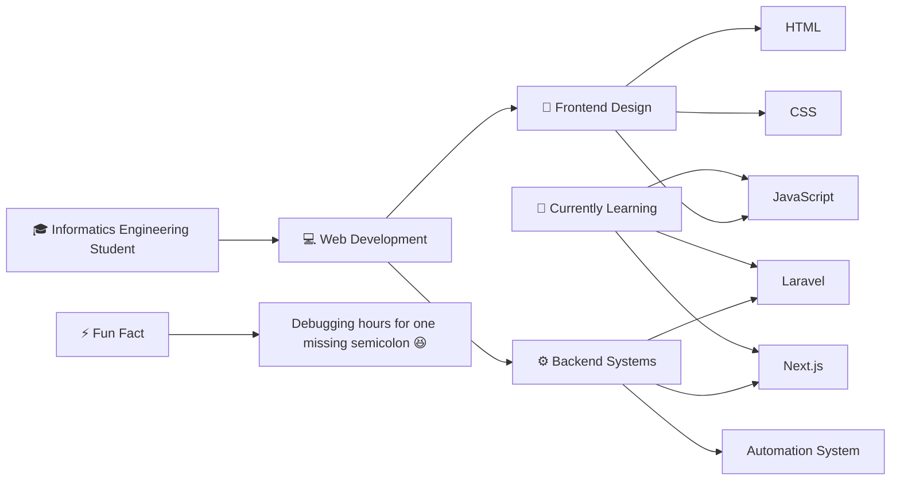

<h1 align="center">Hi 👋 I'm Lidia</h1>
<h3 align="center">Informatics Engineering  | Future Web Developer 🚀</h3>

Passionate about turning ideas into digital products and exploring modern technologies in web development.

---

## 🧭 About Me

---

# 🎨 Tech Stack

---

# 🚀 Real World Projects

<table>

<tr>

<td width="50%">

### 🕋 Hajj & Umrah Landing Page

Landing page website for Hajj & Umrah travel services providing package information and service details.

Tech Stack

</td>

<td width="50%">

### 💼 Financial Management System — BAPPEDA

Web application developed to manage and monitor financial activities in a government institution.

Tech Stack

</td>

</tr>

<tr>

<td width="50%">

### 📦 Back Order Control — PT Denso Indonesia

Dashboard system to monitor **live tracking of delayed or back order items** in supply chain operations.

Tech Stack

</td>

<td width="50%">

### 🏭 BNF Material Control System

Internal system built using modern web technology to assist the **PC Material Control division**.

Tech Stack

</td>

</tr>

<tr>

<td width="50%">

### 🤖 PO Automation System

Automation system that automatically sends **daily purchase order plan emails to suppliers**.

Tech Stack

</td>

</tr>

</table>

---

# 📊 GitHub Stats

---

# 🐍 Contribution Snake

---

# 👀 Profile Visitors

---

<h2 align="center">🌐 Connect With Me</h2>

---

⭐ <b>Thanks for visiting my GitHub profile!</b>

